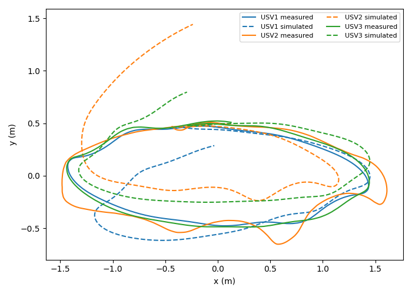
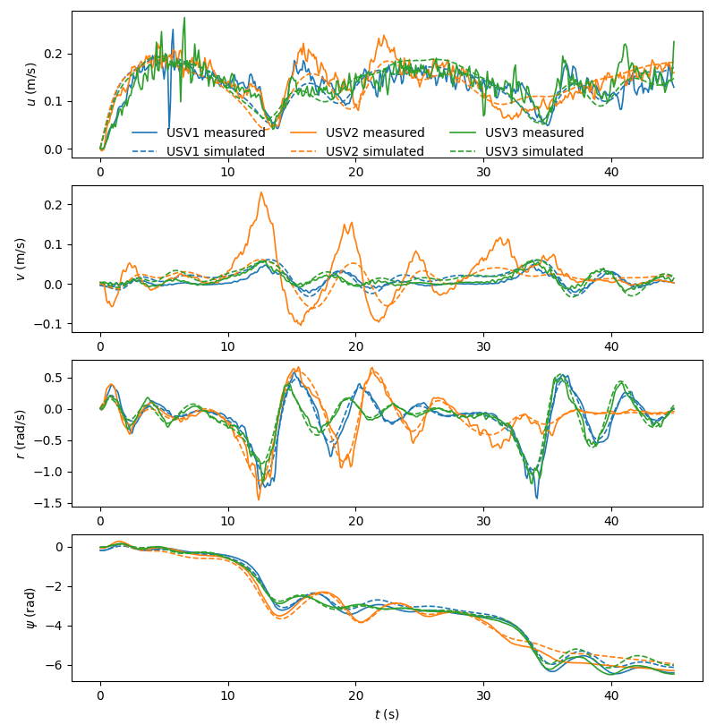
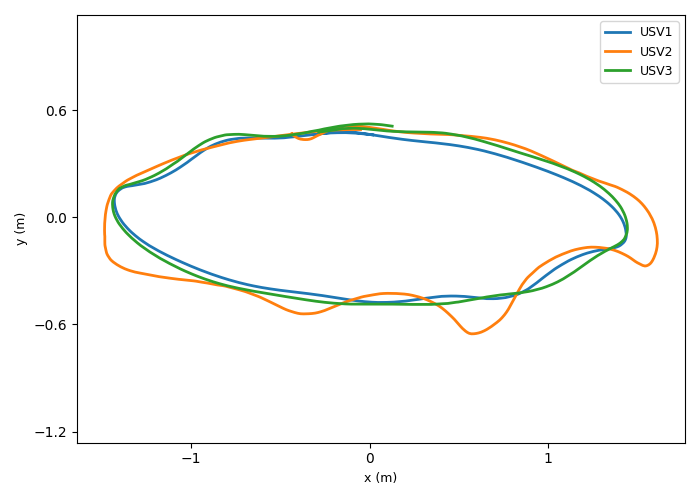
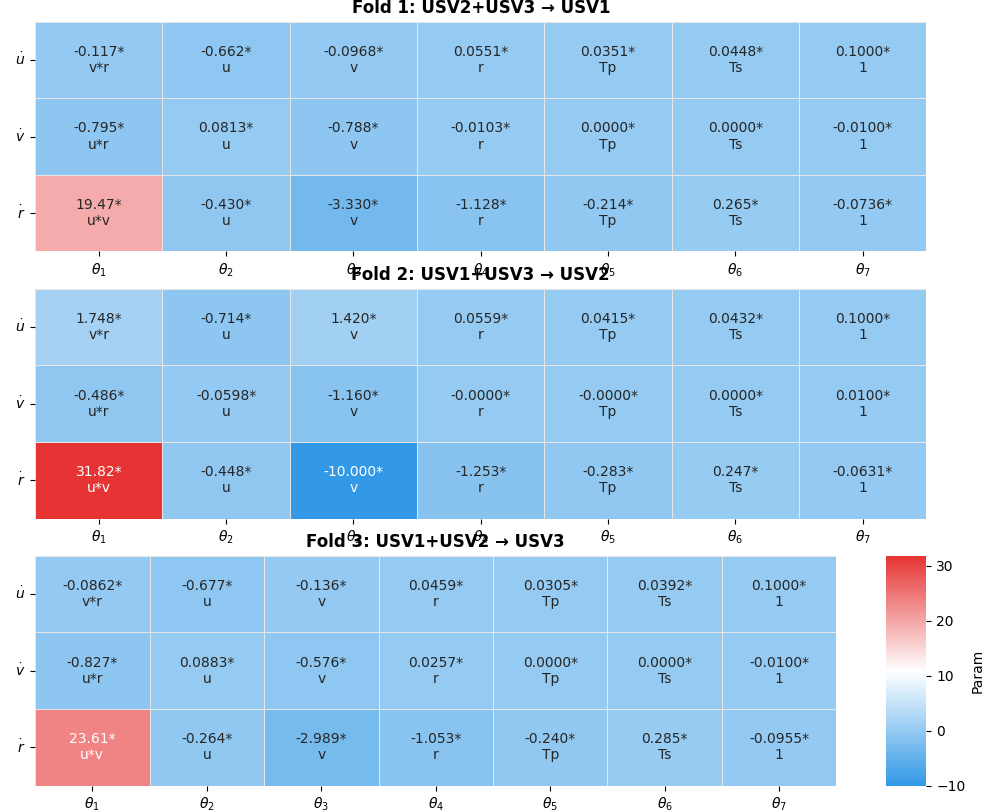
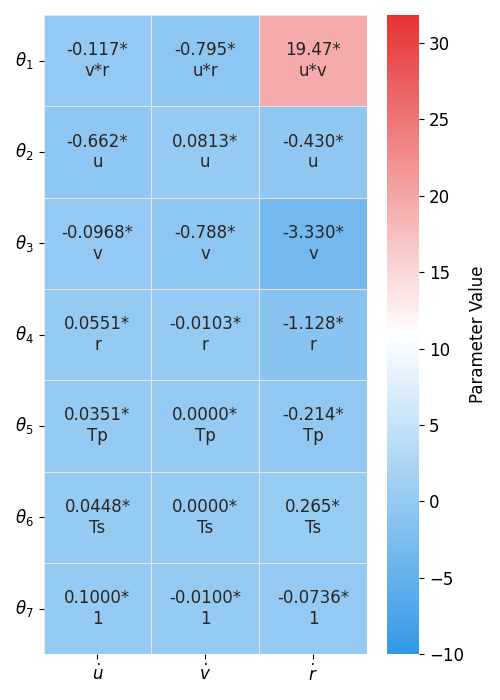
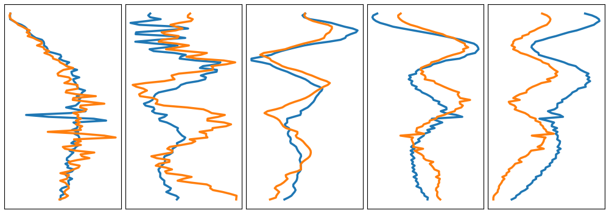
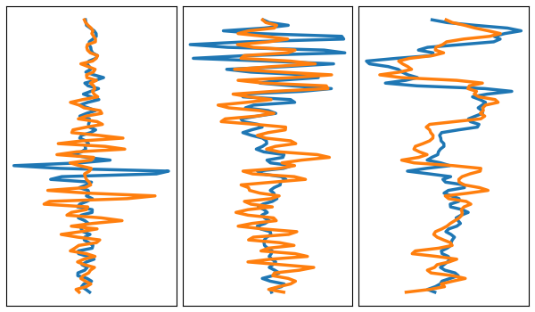

# Formation_Switching_Control_of_USVs

Formation Switching Control of USVs: Identification and NMPC

Demo video: [Formation Switching Control of USVs](https://youtu.be/CU5vH-Tl3m8)

[English Version](README.md)

## 数据集介绍

本项目包含三艘无人水面艇(USV)的实验数据，存储在 `data/` 目录下：

- `usv1_data.xlsx` - USV1 的实验数据
- `usv2_data.xlsx` - USV2 的实验数据
- `usv3_data.xlsx` - USV3 的实验数据

### 数据格式

每个 Excel 文件包含以下列：

| 列名    | 说明            | 单位 |
| ------- | --------------- | ---- |
| x       | x 轴位置        | m    |
| y       | y 轴位置        | m    |
| Heading | 航向角          | 度   |
| u       | 纵向速度        | m/s  |
| v       | 横向速度        | m/s  |
| PWM_L   | 左推进器 PWM 值 | -    |
| PWM_R   | 右推进器 PWM 值 | -    |

### 数据采样参数

- 采样频率：10 Hz（dt = 0.1 s）
- 默认使用数据行数：450 行
- 数据来源：实际 USV 实验采集

## Multi-USV 模型识别

`multi_usv_identification.py` 用于通过多艇数据进行联合建模，采用 3 折交叉验证评估模型泛化能力。

### 识别流程

1. **单艇预处理**

   - 航向角转换：度 → 弧度，并解包裹
   - 计算角速度：r = d(psi)/dt
   - 平滑处理：使用 Savitzky-Golay 滤波器平滑 u、v、r
   - 计算加速度：du、dv、dr（有限差分）
   - PWM 中心化：PWM - 1500
2. **归一化**

   - 仅对控制输入 Tp、Ts 进行标准化
   - 状态变量（u、v、r）保持原始值
3. **构建回归矩阵**

   - 为每艘艇构建块对角特征矩阵（3N × 21）
   - 模型形式：
     ```
     du = a1*v*r + a2*u + a3*v + a4*r + a5*Tp + a6*Ts + a7
     dv = b1*u*r + b2*u + b3*v + b4*r + b5*Tp + b6*Ts + b7
     dr = c1*u*v + c2*u + c3*v + c4*r + c5*Tp + c6*Ts + c7
     ```
4. **3 折交叉验证**

   - Fold 1: 训练 [USV2+USV3] → 测试 [USV1]
   - Fold 2: 训练 [USV1+USV3] → 测试 [USV2]
   - Fold 3: 训练 [USV1+USV2] → 测试 [USV3]
5. **约束优化**

   - 使用 SLSQP 算法
   - 基于物理意义的参数边界约束

### 使用方法

直接运行脚本即可：

```bash
python multi_usv_identification.py
```

### 输出结果

1. **控制台输出**

   - 每艘艇的数据统计信息
   - 交叉验证过程和收敛状态
   - 详细的 MSE 结果表格
   - 识别出的模型参数方程
2. **可视化图表**

   | 图片 | 说明 |
   |-----|-----|
   |  | **轨迹跟踪对比** - 三艘 USV 的实测与仿真轨迹对比 |
   |  | **状态变量对比** - 纵向速度 u、横向速度 v、角速度 r 和航向角 ψ 随时间的变化 |
   |  | **三艘 USV 实测轨迹** |
   |  | **三折交叉验证参数热力图** - 三个 Fold 识别出的模型参数 |
   |  | **Fold 1 参数热力图** - USV2+USV3 训练、USV1 测试的模型参数 |
   |  | **回归误差分析（5折）** |
   |  | **回归误差分析（3折）** |

3. **实验结果总结**
   - 最佳模型：USV2+USV3 训练 → USV1 测试，综合 Score = 0.614
   - 三折交叉验证均收敛，模型泛化能力良好

### 配置参数

可在脚本顶部修改以下配置：

```python
DATA_DIR   = 'data'              # 数据目录
BOAT_FILES = ['usv1_data.xlsx', 'usv2_data.xlsx', 'usv3_data.xlsx']
START_ROW  = 0                   # 起始行
N_ROWS     = 450                 # 使用数据行数
DT         = 0.1                 # 采样周期
SAVGOL_WIN = 5                   # 平滑窗口大小
PWM_CENTER = 1500.0              # PWM 中心值
```

## 依赖库

```bash
pip install numpy pandas matplotlib scipy scikit-learn seaborn openpyxl
```

## 引用

如果使用本项目代码，请引用：

```
@ARTICLE{Fan2026muti,
  author={Fan, Yunsheng and Liu, Peng and Fugao, Duan and Sun, Xiaojie and Xiaoning, zhang and An, Quan},
  journal={IEEE Internet of Things Journal},
  title={Multi-USV Model Identification and Formation Switching Control: Design and Experiments},
  year={2026},
}
```

## 许可证

详见 LICENSE 文件。
